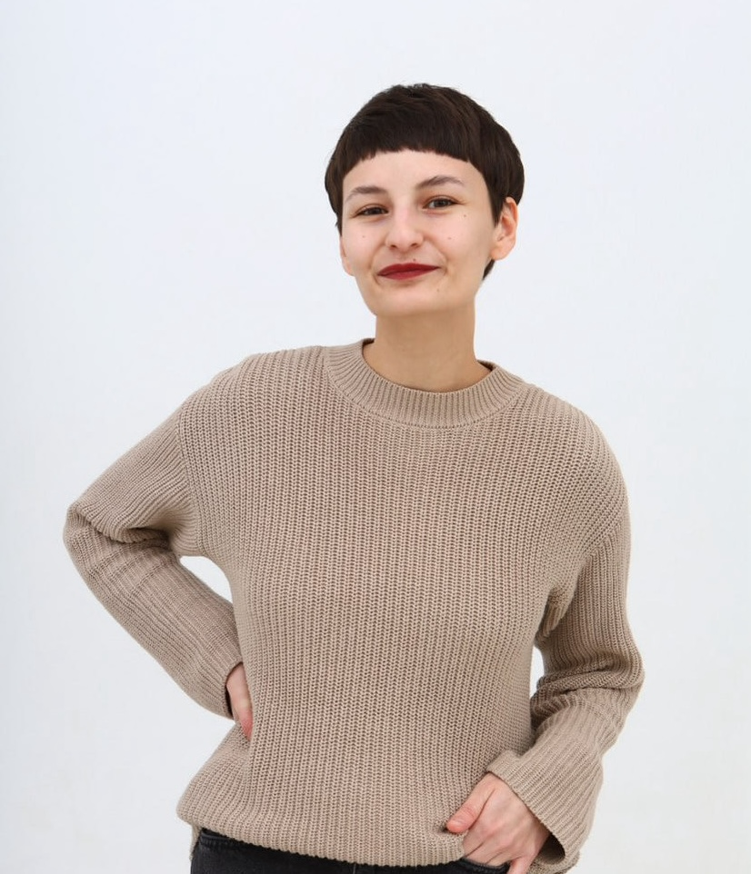

# Anna Meliksetian  

_PhD candidate / Cognitive Neuroscience_  

**Email:** anna.meliksetian@doctoral.uj.edu.pl
**OCRID:** [0009-0004-0163-6745](https://orcid.org/0009-0004-0163-6745)  
**LinkedIn:** [ameliksetian](https://www.linkedin.com/in/ameliksetian/))  

## About  
I am a PhD student at Jagiellonian University and a member of the LangUsta (Psychology of Language and Bilingualism) lab in Kraków, Poland. My research focuses on language processing in multilinguals with a particular interest in how they apply language control and domain-general cognitive control. Specifically, I explore whether the there is a relationship between the control processes and the level of proximity in a language pair. In my free time, I engage in various EdTech projects.  

## Education  
**PhD, Cognitive Neuroscience** 
Jagiellonian University, Kraków, Poland (2021 – 2026)  

**MSc, Theoretical and Experimental Psychology** (with honors) 
Lomonosov Moscow State University, Moscow, Russia (2017 – 2019)

**BA, Psychology and Pedagogy in Education** (with honors) 
Russian State University for the Humanities, Moscow, Russia (2013 – 2017)

## Work Experience 
Foxford Online School, Moscow, Russia:
**Metrics Analyst** (2020 – 2021)  
**Course Administrator** (2020 – 2020)
**Methodologist** (2019 – 2020)

Lomonosov Moscow State University, Moscow, Russia:
**Assistant: Department of Work Psychology** (2017 – 2018)  

## Publications  
**Formation of grammatical skills in the English language based on the didactic system of Piotr Galperin** (in Russian)
Scientific-Methodological Electronic Journal “Concept,” 26, 786–790, 2016, ISSN 2304-120X, [link](https://e-koncept.ru/2016/46958.htm)

**Implementation of philosophical foundations of humane pedagogy on the example of the student project “Epidemic of Mastery”** (in Russian)
Scientific-Methodological Electronic Journal “Concept”, 3, 61–65, 2015, ISSN 2304-120X, [link](https://e-koncept.ru/2015/65263.htm)

**Usage of children’s literature as the foundation of an art therapy program with children under state care: a review of experience** (in Russian)
Scientific Journal “The Young Scientist”, 22.1, 143–146, 2015, ISSN 2072-0297, [link](https://moluch.ru/archive/102/23234/)

## Contact  
You can reach me via [email](anna.meliksetian@doctoral.uj.edu.pl) or on [LinkedIn](https://linkedin.com/in/ameliksetian).  
