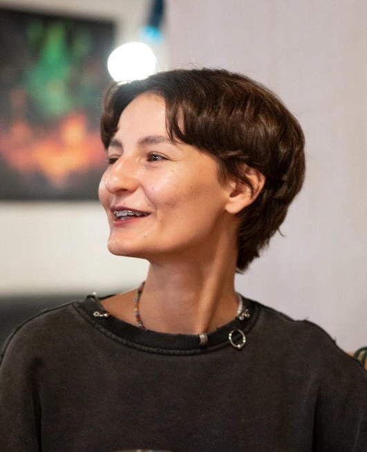

_Researcher at Copernicus Science Centre / PhD candidate in Cognitive Neuroscience at Jagiellonian University_  

- **Email:** anna.meliksetian@kopernik.org.pl / anna.meliksetian@doctoral.uj.edu.pl
- **OCRID:** [0009-0004-0163-6745](https://orcid.org/0009-0004-0163-6745)  
- **LinkedIn:** [linkedin.com/in/ameliksetian](https://www.linkedin.com/in/ameliksetian/)
 
## ABOUT  
PhD candidate in Cognitive Neuroscience with 5 years of experience leading and coordinating multi-country research across academia and EdTech. I do my PhD at the [LangUsta (Psychology of Language and Bilingualism) lab](https://langusta.psychologia.uj.edu.pl) in Kraków, Poland. My research focuses on the modulating effect of language similarity on language and cognitive control in multilinguals. Alongside my academic work, I contribute to the ZBADAI project as a lead researcher at the Copernicus Science Centre.

## EDUCATION  
- **PhD candidate, Cognitive Neuroscience**  
Jagiellonian University, Kraków, Poland (2021 – present)  

- **MSc, Theoretical and Experimental Psychology** (with honors)  
Lomonosov Moscow State University, Moscow, Russia (2017 – 2019)

- **BA, Psychology and Pedagogy in Education** (with honors)  
Russian State University for the Humanities, Moscow, Russia (2013 – 2017)

## WORK EXPERIENCE
Copernicus Science Center, Warsaw, Poland:
- **Senior Specialist / Coordinator of the Research and Evaluation Process** (2026 - present). *[ZBADAI project](https://www.kopernik.org.pl/projekty-dofinansowane/zbadai-projekt-edukacyjny), Department for Research on Competencies of the Future*

Foxford Online School, Moscow, Russia:
- **Metrics Analyst** (2020 – 2021)
- **Product Administrator** (2020 – 2020)
- **Methodologist** (2019 – 2020)

Lomonosov Moscow State University, Moscow, Russia:
- **Assistant: Department of Work Psychology** (2017 – 2018)

## ACADEMIC SERVICE
Cognition - International Journal of Cognitive Science:
- **Ad hoc Reviewer** (2025 – present). *Reviewed submitted articles in the field of psycholinguistics and bilingualism.*

Language Matters in Poland - Celebrating 15 years of Psychology of Language and Bilingualism Lab (LangUsta), Jagiellonian University, Poland:
- **Organizing Committee Member** (Sep 2025). *Selected talks and contributed to designing the scientific program of the conference.*

Social Camp. *Social Camp is a project that aims to support informal education and open dialogue in Belarusian society affiliated with Goethe Institute, Warsaw*:
- **Mentor in the field of EdTech** (2024 - 2025). *Conducted 10 one-hour mentoring sessions with an early-stage entrepreneur in the field of education technology.*

## PUBLICATIONS 
*Meliksetian.* **Research Report: AI in education – from idea to practice. Evaluating the outcomes of a Hackathon for teachers** (in Polish). Copernicus Science Centre, 2026, [link](https://www.kopernik.org.pl/sites/default/files/2026-09/Raport%20badawczy%20AI%20w%20edukacji%20-%20od%20pomysłu%20do%20praktyki.pdf)

*Lijewska, Wolna, Durlik, Meliksetian, Sorace, Wodniecka.* **The influence of L2 immersion and L1-reimmersion on reading and grammatical preferences in L1 anaphora**. Bilingualism: Language and Cognition (R&R, Mar 2026).

*Meliksetian.* **Formation of grammatical skills in the English language based on the didactic system of Piotr Galperin** (in Russian). Scientific-Methodological Electronic Journal “Concept,” 26, 786–790, 2016, ISSN 2304-120X, [link](https://e-koncept.ru/2016/46958.htm)

*Meliksetian.* **Implementation of philosophical foundations of humane pedagogy on the example of the student project “Epidemic of Mastery”** (in Russian). Scientific-Methodological Electronic Journal “Concept”, 3, 61–65, 2015, ISSN 2304-120X, [link](https://e-koncept.ru/2015/65263.htm)

*Meliksetian.* **Usage of children’s literature as the foundation of an art therapy program with children under state care: a review of experience** (in Russian). Scientific Journal “The Young Scientist”, 22.1, 143–146, 2015, ISSN 2072-0297, [link](https://moluch.ru/archive/102/23234/)

## INVITED TALKS

**Two languages, one mind** (in Polish). Open lecture for the employees of the Copernicus Science Centre, Warsaw, Sep 23, 2026.

**Research Report: AI in education – evaluating the outcomes of a Hackathon for teachers** (in Polish). Premiere of the course on AI, [ZBADAI project](https://www.kopernik.org.pl/en/node/3616), Copernicus Science Centre, Warsaw, Sep 3, 2026.

**PhD opportunities in Jagiellonian University**. Open lecture for the Lane Kirkland Scholarship Program recipients, Leaders of Change Foundation, Kraków, Mar 30, 2026.

**Academia in Poland - career opportunities**. PIRE Program in Language Learning and Bilingualism Undergraduate Meeting, University of California, Irvine, Aug 13, 2025 (hosted by prof. dr Judith Kroll).

**Does language proximity modulate language co-activation and domain-general control in multilinguals?** The Bilingualism, Mind, and Brain Lab Talk, University of California, Irvine, Jul 21, 2025 (hosted by prof. dr Judith Kroll).

**Exploring the role of language proximity in language and domain-general control in multilinguals**. Northeastern University London, Oct 23, 2024 (hosted by dr Julia Hofweber).

## CONFERENCE PRESENTATIONS

### 2026
**Does language proximity modulate language co-activation and language control in multilinguals?**. 14th International Conference on Third Language Acquisition and Multilingualism (IAM L3), Adam Mickiewicz University, Poznań, Poland, Sep 3 - 5 (talk).

### 2025
**Defining Language Proximity**. Language Matters in Poland - Celebrating 15 years of Psychology of Language and Bilingualism Lab (LangUsta), Jagiellonian University, Kraków, Poland, Sep 29 - 30 (talk).

**Bilingualism Matters - current projects organised by the Kraków Branch**. The Spring/Summer Institute-wide Poster Session (SIPS), Kraków, Poland, June 27, 2025 (poster presentation).

**Does language proximity modulate language co-activation and domain-general control in multilinguals?** The 15th International Symposium on Bilingualism (ISB15), San-Sebastian, Spain, June 9 – 13, 2025 (talk).

**Exploring the role of language proximity in language and domain-general control in multilinguals**. Adaptations to Multilingualism and the Role of Linguistic Proximity (ATOM), Barcelona, Spain, Feb 13 – 14, 2025 (talk).

### 2024
**How does the presence of cognates impact the engagement of language control?** Highlights in the Language Sciences Conference (HILS), Nijmegen, the Netherlands, July 8 – 11, 2024 (poster preparation).

**Deciphering Unfamiliar Languages: Mutual Intelligibility of Czech, Russian, and Spanish in Relation to Polish**. The Spring/Summer Institute-wide Poster Session (SIPS), Kraków, Poland, June 14, 2024 (poster presentation).

**Deciphering Unfamiliar Languages: Mutual Intelligibility of Czech, Russian, and Spanish in Relation to Polish**. Conference on Multilingualism (COM), Aix-en-Provence, France, June 10 - 12, 2024 (poster presentation).

**Mutual Intelligibility Of Czech, Russian, And Spanish In Relation To Polish: the role of shared phonology and semantics**. International Max Planck Research School (IMPRS) for Language Sciences, Nijmegen, the Netherlands, June 5 – 7, 2024 (poster presentation).

**Impact of cross-language similarity on language control**. NEURONUS Neuroscience Forum, Kraków, Poland, Apr 25 - 27, 2024 (poster presentation).

### 2022
**Exploring cross-language similarity and language control in multilingual language production**. Barcelona Summer School on Bilingualism and Multilingualism (BSBM), Barcelona, Spain, Sep 23 - 15, 2022 (talk).

**Language control during language production: the role of cross-language similarity**. The NYI Global Institute of Cultural, Cognitive and Linguistic Studies - V-NYI #5 CogFest, international team (online), July 13, 2022 (talk).

### 2021
**How Bilingualism Became the Norm and Monolingualism the Illiteracy of the 21st Century**. Lane Kirkland Scholarship Program Alumni Congress, Warsaw, Poland, Nov 6 - 7, 2021 (talk).

### 2016
**Cognitive factors in creating narratives by preschool children**. 17th International Readings in Memory of Lev Vygotsky: cultural-historical psychology - from scientific revolution to transformation of social practices, Moscow, Russia, Nov 14 - 17, 2016 (talk).

## GUEST LECTURES
**Czy umysł osób dwujęzycznych funkcjonuje tak samo jak jednojęzycznych? (Does a bilingual brain function the same way as monolingual? in Polish)**. Course: Methodology of teaching a foreig language. Lecturer: dr Karolina Gołąbek; Jagiellonian University, Kraków, Poland, Mar 16, 2026.

**L2 Acquisition in Adult Language Learners**. Course: Life in two languages - cognitive apects of bilingualism. Lecturer: prof. dr Zofia Wodniecka; Jagiellonian University, Kraków, Poland, May 6, 2025.

**Is two better than one? Cognitive consequences of bilingualism**. Course: Life in two languages - cognitive apects of bilingualism. Lecturer: prof. dr Zofia Wodniecka; Jagiellonian University, Kraków, Poland, Mar 25, 2025.

**Czy umysł osób dwujęzycznych funkcjonuje tak samo jak jednojęzycznych? (Does a bilingual brain function the same way as monolingual? in Polish)**. Course: Methodology of teaching a foreig language. Lecturer: dr Karolina Gołąbek; Jagiellonian University, Kraków, Poland, Feb 26, 2025.

**Czy umysł osób dwujęzycznych funkcjonuje tak samo jak jednojęzycznych? (Does a bilingual brain function the same way as monolingual? in Polish)**. Course: Psychologia i neuronauka poznawcza (Psychology and cognitive neuroscience). Lecturer: prof. dr Zofia Wodniecka; Jagiellonian University, Kraków, Poland, Nov 26, 2024.

## GRANTS AND SCHOLARSHIPS
**Calouste Gulbenkian Foundation, Armenian Communities Department** (Dec 2025). I received a grant for the standardisation of the Multilingual Picture Database (MultiPic, Duñabeitia et al., 2022) for the Eastern Armenian language. Grant nr: 351201.

**Stipend for young researchers, OPUS, Polish National Science Centre** (Oct 2025). I received a stipend for working on a project  “Mechanisms of language control underlying speech production in bilinguals: an fMRI study” implemented at the Psychology of Language and Bilingualism Laboratory, Jagiellonian University. Grant nr: 2017/27/B/HS6/00959, PI: prof. dr Zofia Wodniecka-Chlipalska.

**Research funding "Research Support Module" within the Excellence Initiative** (Oct 2024). I received a grant for the data collection within a project exploring the role of the context of migration on language control in multilingual language production in a collaboration with prof. dr Judith Kroll and PhD candidate Guadalupe Mesdosa. Grant nr: WSPR.WSDNS.1.4.2024.41(2).

**Stipend for young researchers, SONATA, Polish National Science Centre** (Oct 2022). I received a stipend for working on a project "Competition or cooperation? Impact of short-term and long-term language experience on language regulation and cognitive functions in bilinguals" implemented at the Psychology of Language and Bilingualism Laboratory, Jagiellonian University. Grant nr: 2015/18/E/HS6/00428, PI: prof. dr Zofia Wodniecka-Chlipalska.

**Research funding "Research Support Module" within the Excellence Initiative** (July 2022). I received a grant for the implementation of a project exploring the role of mutual intelligibility on language control in multilingual language production, which then constituted a part of my PhD project. Grant nr: WSPR.WFiloz.1.5.2022.7.

**The Lane Kirkland Program Scholarship** (Sep 2020 - June 2021). I was awarded a scholarship for two-term university training at selected Polish universities within the Lane Kirkland Scholarship Program. The Program is funded by the Polish-American Freedom Foundation and is administered by the Leaders of Change Foundation. During the program, I explored vocabulary learning strategies of Ukrainian natives learning Polish as a foreign language.

**ERASMUS+ Academic Mobility Program Scholarship** (Feb - July 2019). I was selected to participate in the ERASMUS+ Academic Mobility Program. During one semester, I studied at the Institute of Psychology in Jagiellonian University, successfully passing 8 courses (34 ECTS) with GPA of 4.9.

**First prize: National Level Competition in Psychology for the Undergraduate Students** (May 2017). I was awarded first prize in the National Undergraduate Psychology Competition organized by Lomonosov Moscow State University. As a result of this achievement, I became eligible to apply for graduate studies at Russia’s top-ranked university with a full tuition waiver.

**Advanced State Academic Scholarship for Scientific Merit** (Sep 2015 - Feb 2016). I was awarded the Advanced State Academic Scholarship in recognition of my scientific merit, a distinction granted to students demonstrating outstanding academic excellence.

## MEMBERSHIPS AND AFFILIATIONS

**LangUsta – Psychology of Language and Bilingualism Lab, Jagiellonian University**. I am a doctoral researcher at LangUsta, where I investigate language control and domain-general control in multilinguals. Our page: [langusta.psychologia.uj.edu.pl/people](https://langusta.psychologia.uj.edu.pl/people).

**Bilingualism Matters – Kraków Branch**. As a member of Bilingualism Matters Kraków, I help promote research-based awareness of bilingualism among educators, families, and policymakers. Our page: [bmkrakow.uj.edu.pl/zespol](https://bmkrakow.uj.edu.pl/zespol).

## PROFESSIONAL DEVELOPMENT AND TRAINING

### 2026
Teaching Engagement Development (TED) program: “Academic Teachers and PhD Candidates Facing Future Challenges”, *Jagiellonian University co-financed by the European Funds for Social Development 2021 - 2027, IV edition.*

Research Camp: data visualisation, science communication, science popularisation on social media, and science pitching. *Jagiellonian University, University of Warsaw, Adam Mickiewicz University, Sep 15 - 17, 2026.*

Intermediate SQL. *DataCamp, Aug 20, 2026.*

Introduction to SQL. *DataCamp, Aug 6, 2026.*

### 2024
Cognitive Neuroimaging Skills Training In Cambridge (COGNESTIC). *MRC Cognition and Brain Sciences Unit, University of Cambridge, Sep 16 - 27, 2024.*
  
Eighth Summer School on Statistical Methods for Linguistics and Psychology (Introduction to Bayesian data analysis). *University of Potsdam, Sep 9 - 13, 2024.*

International Max Planck Research School for Language Sciences. *Max Planck Institute for Psycholinguistics, June 5 – 7, 2024.*

Creating Successful Research Posters. *Springer Nature - a Nature Masterclasses online course, Apr 17, 2024.*

### 2023
Seventh Summer School on Statistical Methods for Linguistics and Psychology (Foundational methods in frequentist statistics). *University of Potsdam, Sep 11 - 15, 2023.*

Introduction to Structural Equation Modeling for Cross Sectional Data *Jagiellonian University, Sep 5 - 6, 2023.*

Hierarchical and Mixed Effects Models in R. *DataCamp, Apr 18, 2023.*

### 2022
Barcelona Summer School on Bilingualism and Multilingualism. *Pompeu Fabra University, Sep 23 - 15, 2022.*

Theory and Practice of Bayesian Hypothesis Testins: a JASP Workshop. *University of Amsterdam, Aug 29 – 30, 2022.*

V-NYI #5 Summer School in Linguistics, Cognitive and Cultural Studies. *NYI Global Institute of Cultural, Cognitive, and Linguistic studies, June 20 - July 15, 2022.*

Mixed-effects Models in R, Model Selection and Contrasts Coding. *Jagiellonian University, June 22 - 23, 2022.*

### 2021
Introduction to the Tidyverse. *DataCamp, Mar 11, 2021.*

Intermediate R. *DataCamp, Jan 15, 2021.*

## SELECTED RESEARCH PROJECTS
**PI: Standardisation of the Multilingual Picture Database (MultiPic) for the Eastern Armenian Language** (Dec 2025 - June 2026). 

In a collaborative project with the University of Readink, UK, I conduct the standardisation of the MultiPic database for the Eastern Armenian language. I am responsible for the adaptation of the experimental task to the Armenian language, recruitment of the representative sample, data analysis, and reporting the final results.

*Affiliation: Jagiellonian University, Kraków, Poland*

**PI: Language and cognitive control in migrant populations: a study on Ukrainian-Polish bilinguals** (Oct 2024 - May 2025). 

In a collaborative project with the Bilingualism, Mind, and Brain Lab (University of California, Irvine), I investigate the language control and cognitive control indices in migrant populations. I am responsible for the assessment of a migrant population that speaks languages of high proximity: Ukrainians residing in Poland.

*Affiliation: Jagiellonian University, Kraków, Poland*

**PI: Exploring language proximity and magnitude of language control during multilingual language production** (Oct 2021 - present). 

In my PhD project, I investigate the relationship between language proximity and language control in bilinguals. I aim to compare the magnitude of language control and domain-general cognitive control indices in several bilingual groups that speak languages with varying degrees of language proximity.

*Scientific advisor: prof. dr Zofia Wodniecka*  
*Affiliation: Jagiellonian University, Kraków, Poland*

**PI: Vocabulary learning strategies in acquiring an artificial language grammatically similar to Polish** (Sep 2020 - July 2021). 

I compared the effectiveness of vocabulary learning strategies when learning a language similar to one's native. Participants - native Ukrainian speakers - had to learn the vocabulary of an artificial language similar to Polish. The word association strategy showed the highest effectiveness in vocabulary learning.

*Scientific advisor: prof. dr Zofia Wodniecka*  
*Affiliation: Jagiellonian University, Kraków, Poland*

**PI: Strategies of word search and recognition in native Japanese, Chinese and Russian bilinguals** (Sep 2017 - June 2019). 

During my graduate studies, I explored the strategies of word search and recognition utilized by the Russian, Japanese and Chinese native speakers with varying level of language proficiency in English. The registration of eye-movement patterns revealed the association of the unique features of strategies with the group differences in the native language writing system, the level of English proficiency, and the language background.

*Scientific advisor: dr Irina Blinnikova*  
*Affiliation: Lomonosov Moscow State University, Moscow, Russia*

**RA: How language experience impacts cognitive control** (Mar 2018 - July 2018). 

I participated in the implementation of the research project "How language experience impacts cognitive control" supported by a grant awarded to Penn State University, USA, and Polish National Science Center, Poland. I performed the duties of a research assistant and interacted with the study participants during the experimental sessions.

*Affiliation: Jagiellonian University, Kraków, Poland*

**PI: Structural features of children's narratives and their connection to dialectic thinking in senior preschoolers** (Sep 2013 - June 2017). 

During my undergraduate studies, I explored the children's narratives created with the help of a visual model and identified their main structural features. I then attempted to draw connections between the structural features in a child narrative and their stage of the dialectic thinking development.

*Scientific advisor: dr Olga Shiyan*  
*Affiliation: Russian State University for the Humanities, Moscow, Russia*

## LANGUAGES
- Russian (native speaker)
- Armenian (native spreaker, limited proficiency)
- English (C2)
- Polish (C1)

## CONTACT 
You can reach me via email (anna.meliksetian@doctoral.uj.edu.pl, anna.meliksetian@kopernik.org.pl) or on [LinkedIn](https://linkedin.com/in/ameliksetian).  

Last updated on Oct 1, 2026
